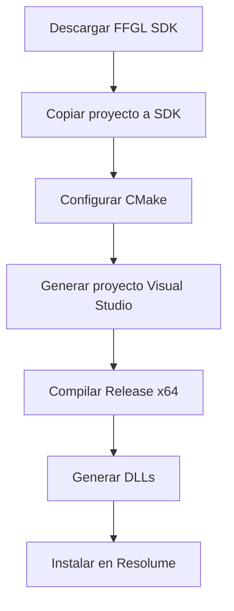

# 📦 Estructura del Proyecto - Resolume Super Plugins

```
ResolumeSuperPlugin/
│
├── 📄 INSTRUCCIONES_COMPILAR.md     ← Instrucciones de compilación
├── 📄 PARTICLE_SYSTEM_README.md     ← Documentación completa del sistema de partículas
├── 📄 QUICK_START.md                ← Guía rápida y presets
├── 📄 PROJECT_STRUCTURE.md          ← Este archivo
├── 📄 README.md                     ← README original
├── 📄 LEEME.txt                     ← Información general
│
├── 📄 CMakeLists.txt                ← Configuración de compilación para ambos plugins
│
├── 🔷 PLUGIN 1: Super Ultra Plugin (Original)
│   ├── SuperPlugin.cpp              ← Código fuente del plugin de efectos
│   └── shader.glsl                  ← Shader GLSL con 10 efectos
│
├── 🔷 PLUGIN 2: Particle Cloud System (Nuevo)
│   ├── ParticleCloudPlugin.cpp              ← Código fuente del sistema de partículas
│   ├── particle_simulation_shader.glsl      ← Shader de simulación de partículas
│   ├── particle_render_vertex.glsl          ← Vertex shader para renderizado
│   └── particle_render_fragment.glsl        ← Fragment shader para renderizado
│
└── build/                           ← Carpeta generada por CMake
    └── bin/
        ├── SuperPlugin.dll          ← Plugin compilado 1
        └── ParticleCloudPlugin.dll  ← Plugin compilado 2
```

---

## 🎯 PLUGINS INCLUIDOS

### 1️⃣ Super Ultra Plugin
**Archivo:** `SuperPlugin.cpp`

**Características:**
- 10 efectos visuales avanzados
- Control de color (Brillo, Contraste, Saturación, Hue)
- Pixelación (ResX, ResY)
- Alineación (H/V Align)
- Efecto negativo
- 12 parámetros MIDI mapeables

**Efectos incluidos:**
1. Glitch (aberración cromática + desplazamiento)
2. Kaleidoscope (espejo caleidoscópico)
3. Neon Edges (detección de bordes)
4. Liquid Warp (distorsión líquida)
5. Chromatic Aberration (aberración radial)
6. Scanlines (líneas de escaneo)
7. Mirror Quad (espejo cuádruple)
8. Invert/Solarized (inversión y solarización)
9. Vignette & Grain (viñeta y grano)
10. ASCII/Dot Matrix (efecto dot matrix)

---

### 2️⃣ Particle Cloud System
**Archivos principales:** 
- `ParticleCloudPlugin.cpp`
- `particle_simulation_shader.glsl`
- `particle_render_vertex.glsl`
- `particle_render_fragment.glsl`

**Características:**
- Sistema de partículas GPU (miles de partículas en tiempo real)
- **38 parámetros** MIDI mapeables
- **12 modos de comportamiento**
- **6 modos de color**
- Sistema de trails/estelas
- Formaciones de texto e imágenes
- Efectos de glow y brillo

**Modos de Comportamiento:**
0. Free/Random - Movimiento libre
1. Attract - Atracción al centro
2. Repel - Repulsión desde centro
3. Orbital - Movimiento orbital
4. Flow Field - Campo de flujo (curl noise)
5. Turbulence - Turbulencia alta
6. Flocking - Comportamiento de bandada
7. Wave - Movimiento ondulatorio
8. Spiral - Espiral
9. Explosion - Explosión
10. Formation - Formación de imagen/texto
11. Vortex - Vórtice giratorio
12. Grid/Lattice - Cuadrícula

**Parámetros categorizados:**

#### Básicos (5 params)
- Particle Count, Size, Life, Emit Rate, Velocity

#### Física (4 params)
- Gravity, Friction, Turbulence, Randomness

#### Comportamiento (4 params)
- Behavior Mode, Strength, Attractor X/Y

#### Color (5 params)
- Color Mode, Hue Start/End, Saturation, Brightness

#### Efectos Visuales (4 params)
- Trail Length/Fade, Particle Alpha, Blend Mode, Glow Amount

#### Formaciones (2 params)
- Shape Mode, Formation Strength

#### Comportamientos Específicos (14 params)
- Curl Scale/Speed
- Flow Scale/Speed
- Orbital Speed/Radius
- Wave Amplitude/Frequency
- Spiral Tightness/Speed
- Explosion Force
- Time Scale
- Reset Particles

---

## 🛠️ PROCESO DE COMPILACIÓN



**Comando CMake:**
```bash
mkdir build
cd build
cmake .. -G "Visual Studio 17 2022" -A x64
cmake --build . --config Release
```

**Output:**
- `build/bin/SuperPlugin.dll`
- `build/bin/ParticleCloudPlugin.dll`

---

## 📚 DOCUMENTACIÓN

### Para empezar:
1. **INSTRUCCIONES_COMPILAR.md** - Compila los plugins
2. **QUICK_START.md** - Empieza a usar en 5 minutos

### Para profundizar:
3. **PARTICLE_SYSTEM_README.md** - Documentación completa del sistema de partículas
4. Este archivo (**PROJECT_STRUCTURE.md**) - Estructura del proyecto

---

## 🎮 CONTROL MIDI

Ambos plugins son **100% MIDI mapeables** en Resolume:

### Super Ultra Plugin (12 parámetros)
- Brightness, Contrast, Saturation, Hue
- Res X/Y, H/V Align
- Negative, Effect Mode, Effect Amount, Time

### Particle Cloud System (38 parámetros)
- Ver `PARTICLE_SYSTEM_README.md` para lista completa

**Cómo mapear:**
1. Click derecho en cualquier parámetro en Resolume
2. "MIDI Learn"
3. Mueve tu control MIDI
4. ¡Listo!

---

## 🔧 REQUISITOS DEL SISTEMA

### Para Compilar:
- **CMake** 3.10+
- **Visual Studio 2019/2022** (Community Edition OK)
- **FFGL SDK** de Resolume
- **OpenGL** (incluido con drivers de GPU)

### Para Usar:
- **Resolume Arena 7.x** o **Avenue 7.x**
- **Windows 10/11** (64-bit)
- **GPU** con soporte OpenGL 3.3+
- **4GB RAM** mínimo (8GB recomendado para Particle Cloud)

### Rendimiento Particle Cloud:
| GPU Tier | Particle Count | FPS Esperado |
|----------|----------------|--------------|
| Integrada | 0.0 - 0.3 | 30-60 |
| Media (GTX 1060) | 0.3 - 0.6 | 60+ |
| Alta (RTX 3060+) | 0.6 - 1.0 | 60+ |

---

## 🎨 CASOS DE USO

### Super Ultra Plugin - Mejor para:
- Post-procesamiento de video
- Efectos glitch y retro
- Edición de color en tiempo real
- Efectos geométricos (kaleidoscope, mirror)
- Pixelación artística

### Particle Cloud System - Mejor para:
- Visuales generativos
- Backgrounds animados
- Logos animados con partículas
- Efectos de energía y magia
- Simulaciones físicas artísticas
- Visuales VJ en vivo
- Content creation de redes sociales

---

## 🚀 PRÓXIMOS PASOS

1. **Compila** los plugins siguiendo `INSTRUCCIONES_COMPILAR.md`
2. **Instala** en Resolume
3. **Lee** `QUICK_START.md` para presets inmediatos
4. **Experimenta** con los parámetros
5. **Mapea MIDI** para control en vivo
6. **¡Crea arte increíble!**

---

## 📝 NOTAS TÉCNICAS

### Shaders GLSL
- **Version:** 120 (OpenGL 2.1 compatible)
- **Formato:** GLSL embedded in C++ strings
- **Optimización:** Fragment-heavy, optimizado para GPU

### Arquitectura Particle System
- **Simulación:** GPU-based usando feedback buffers
- **Renderizado:** Point sprites con custom shaders
- **Updates:** Por-frame en shader
- **Colisiones:** Boundary wrapping/bouncing

### Performance Tips
- Particle Cloud usa mucha GPU
- Reduce Particle Count si hay lag
- Desactiva Trails para mejor performance
- Use Blend Mode = Alpha para menos GPU load

---

## 🆘 TROUBLESHOOTING

### Los plugins no aparecen en Resolume
✅ Verifica que sean **x64** (64-bit)
✅ Verifica que estén en la carpeta correcta de plugins
✅ Revisa el log de Resolume en `%APPDATA%\Resolume Arena\`

### Error de compilación
✅ Verifica rutas del FFGL SDK en CMakeLists.txt
✅ Asegúrate de tener Visual Studio 2019/2022
✅ Compila en modo **Release x64**

### Performance bajo
✅ Reduce Particle Count (Particle Cloud)
✅ Desactiva efectos pesados (Trails, Glow)
✅ Cierra otras aplicaciones
✅ Actualiza drivers de GPU

---

## 📧 SOPORTE

¿Problemas? ¿Preguntas? ¿Ideas?

Comparte:
- Tu configuración (GPU, Resolume version, etc.)
- Qué estás intentando hacer
- Screenshots o videos del problema
- Logs de Resolume si hay crashes

---

## 🌟 CRÉDITOS

**Desarrollado con:**
- FFGL SDK by Resolume
- OpenGL
- GLSL Shaders
- C++14

**Inspirado en:**
- TouchDesigner
- Processing
- Cinema 4D X-Particles
- Houdini POPs

**Creado por:** Antigravity AI
**Versión:** 1.0 (2025)

---

**¡Disfruta creando! 🎨✨🚀**
